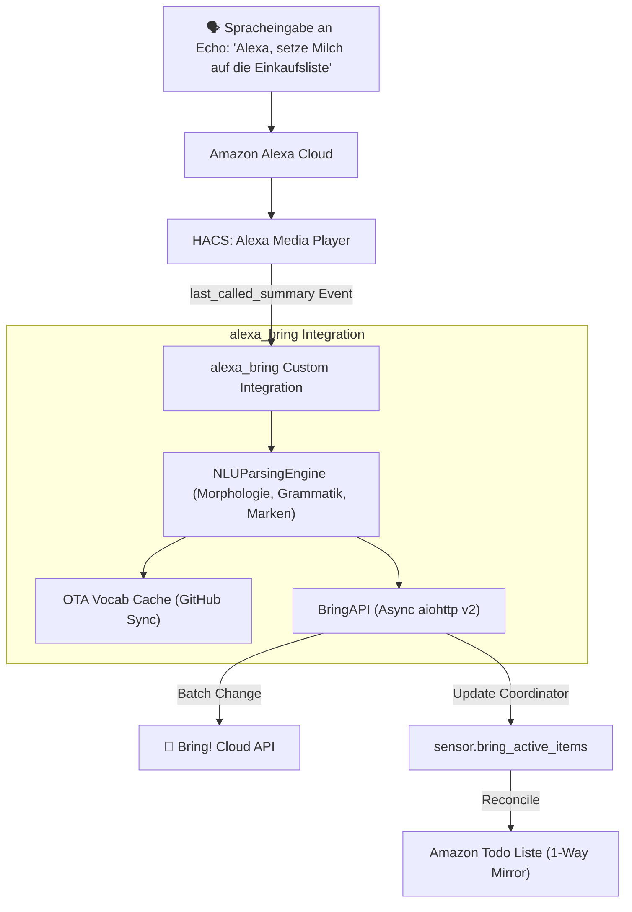

# 🛒 Alexa to Bring! Sync (Home Assistant Integration)

[](https://github.com/hacs/default)
[](https://www.home-assistant.io/)
[](LICENSE)
[](https://www.getbring.com/)

> **Die native Home Assistant Custom Integration für nahtlose Sprachsynchronisation zwischen Amazon Echo (Alexa) und deiner Bring! Einkaufsliste.**  
> Keine YAML-Konfiguration, keine manuellen Python-Skripte mehr – 100 % Konfiguration über die Benutzeroberfläche (UI) inklusive HACS-Unterstützung und automatischer Lebensmittel-Erkennung (NLU).

---

## 🌟 Highlights & Funktionen

* 🗣️ **Nativer Alexa-Sprachbefehl:**  
  *„Alexa, setze 2 Bananen, Hafermilch und Nutellakekse auf die Einkaufsliste“*
* 🧠 **Fortschrittliche NLU (Natural Language Understanding):**
  * **Mengenerkennung:** Erkennt Zahlen, Brüche und Einheiten (*„ein halbes Kilo Mehl“*, *„2 Packungen Butter“*) und trennt sie sauber in Mengenspezifikationen ab.
  * **Automatisches Compound-Splitting:** Trennt zusammengesetzte Nomen wie *„Nutellakekse“* ➔ Name: *„Kekse“*, Spezifikation: *„Nutella“*, damit Bring! immer das richtige Symbol/Icon zuordnet.
  * **Markenerkennung & Normalisierung:** Erkennt Marken (*„Paulaner Spezi“*, *„Coca Cola Zero“*, *„Gustavo Gusto“*) und weiß, ob es sich um ein eigenständiges Produkt oder eine Variante handelt.
  * **Deutscher Lemmatizer:** Plural- und Grammatikformen werden automatisch auf die Bring!-Katalogform abgebildet (*„rote Tomaten“* ➔ *„Tomaten“* mit Spezifikation *„rot“*).
* 🔄 **Amazon Todo 1-Way Mirror:**  
  Hält die interne Amazon Alexa Todo-Liste synchron mit Bring!, sodass beide Listen immer denselben Stand zeigen.
* 📦 **Auto-Beautifier:**  
  Auch wenn du unterwegs Einträge per Hand in der Bring!-App tippst, erkennt die Integration diese und formatiert sie sauber auf den Standardkatalog um.
* 🌐 **Over-The-Air (OTA) Lexikon-Updates:**  
  Das Lebensmittel- und Markenlexikon wird im Hintergrund automatisch alle 24 Stunden von GitHub aktualisiert – ganz ohne Neustart oder HACS-Update.
* 🖥️ **100 % UI-Konfiguration (Config Flow & Options Flow):**  
  Bring!-Zugangsdaten, Echo-Geräte (Multi-Select) und die Amazon-Liste werden bequem im Menü ausgewählt und können jederzeit über „Konfigurieren“ angepasst werden.

---

## 📋 Voraussetzungen

1. **Home Assistant** (mind. 2024.1)
2. **[HACS](https://hacs.xyz/)** (Home Assistant Community Store)
3. **[Alexa Media Player](https://github.com/alandtse/alexa_media_player)** (via HACS installiert und mit deinem Amazon-Konto verbunden)
4. Ein aktives **Bring! Konto** (E-Mail & Passwort)

---

## 🚀 Installation via HACS

1. Öffne **HACS** in Home Assistant.
2. Klicke oben rechts auf das Drei-Punkte-Menü (`...`) und wähle **Benutzerdefinierte Repositories** (*Custom repositories*).
3. Füge folgende Repository-URL ein:
   * **Repository:** `https://github.com/springer-homelab/alexa-bring-sync`
   * **Typ:** `Integration`
4. Klicke auf **Hinzufügen**.
5. Suche nach **Alexa to Bring! Sync** und klicke auf **Herunterladen**.
6. Starte Home Assistant neu.

---

## ⚙️ Einrichtung

1. Gehe in Home Assistant auf **Einstellungen ➔ Geräte & Dienste ➔ Integration hinzufügen**.
2. Suche nach **Alexa to Bring! Sync**.
3. **Schritt 1 (Bring! Zugangsdaten):**  
   Gib deine Bring! E-Mail-Adresse, dein Passwort und den gewünschten Listen-Namen ein (Standard: `Einkaufsliste`).
4. **Schritt 2 (Geräte auswählen):**  
   * **Echo Geräte:** Wähle alle Amazon Echo-Lautsprecher aus, die abgehört werden sollen (Mehrfachauswahl möglich).
   * **Amazon Todo Liste:** Wähle deine Alexa Todo-Liste für die automatische Synchronisation aus.
5. Fertig! 🎉

> **Tipp:** Du kannst die ausgewählten Echo-Lautsprecher und die Todo-Liste jederzeit unter *Einstellungen ➔ Geräte & Dienste ➔ Alexa to Bring! Sync ➔ Konfigurieren* ändern.

---

## 🏗️ Architektur



---

## 📁 Repository-Struktur

```text
alexa-bring-sync/
├── custom_components/
│   └── alexa_bring/
│       ├── __init__.py           # Setup, native Event-Listener & Reconciler
│       ├── bring_api.py          # Asynchroner Bring! REST API v2 Client
│       ├── config_flow.py        # UI Setup & Options Flow (Geräteauswahl)
│       ├── const.py              # Konstanten & Domain-Definitionen
│       ├── coordinator.py        # Background Polling & Auto-Beautifier
│       ├── manifest.json         # Home Assistant Integrations-Metadaten
│       ├── nlu_parser.py         # Intelligente Sprachanalyse & Lemmatizer
│       ├── sensor.py             # Sensor für aktive Bring!-Einträge
│       ├── strings.json          # Textbausteine für das Setup
│       └── translations/         # Übersetzungen (Deutsch & Englisch)
├── bring_vocab.json              # Lebensmittel-, Marken- & Synonym-Lexikon
├── hacs.json                     # HACS Metadaten
├── LICENSE                       # MIT Lizenz
└── README.md                     # Dokumentation
```

---

## 📄 Lizenz

Dieses Projekt ist unter der [MIT-Lizenz](LICENSE) lizenziert.
