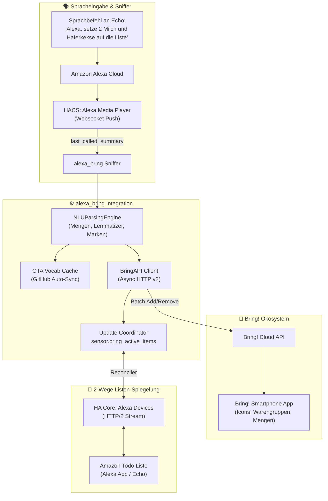

# 🛒 Alexa to Bring! Sync (Home Assistant Integration)

[](https://github.com/hacs/default)
[](https://www.home-assistant.io/)
[](LICENSE)
[](https://www.getbring.com/)

> **Die native Home Assistant Custom Integration für nahtlose Sprachsynchronisation zwischen Amazon Echo (Alexa) und deiner Bring! Einkaufsliste.**  
> Keine YAML-Konfiguration, keine manuellen Python-Skripte mehr – 100 % Konfiguration über die Benutzeroberfläche (UI) inklusive HACS-Unterstützung und automatischer Lebensmittel-Erkennung (NLU).

---

## 🌟 Highlights & Funktionen

* 🗣️ **Nativer Alexa-Sprachbefehl:**  
  *„Alexa, setze 2 Bananen, Hafermilch und Nutellakekse auf die Einkaufsliste“*
* 🧠 **Fortschrittliche NLU (Natural Language Understanding):**
  * **100 % Kollisionsfrei & Sortenvielfalt:** Artikel wie *„Gustavo Gusto Pizza“*, *„Vollkornspaghetti“*, *„Dr. Oetker Backmischung“* oder *„Nutellakekse“* behalten ihren vollen Namen auf der Liste. Gleichzeitig erhalten sie vollautomatisch das passende Bring!-Katalogicon und die richtige Warengruppe – so können z. B. *„Vollkornspaghetti“* und *„Spaghetti“* friedlich nebeneinander existieren, ohne sich gegenseitig zu überschreiben.
  * **Native Symbol- & Warengruppenzuweisung:** Weist auch Nicht-Katalogartikeln, Marken und Backmischungen vollautomatisch das passende Bring!-Katalogicon (z. B. 🧁 *Backpulver* für *„Dr. Oetker Backmischung“*, 🍕 *Pizza* für *„Gustavo Gusto Pizza“*, 🍪 *Kekse* für *„Nutellakekse“*) und die richtige Warengruppe zu.
  * **Mengenerkennung & Spezifikationen:** Erkennt Zahlen, Brüche und Einheiten (*„ein halbes Kilo Mehl“*, *„2 Packungen Butter“*, *„1 Kasten Cola“*) sowie Zubereitungsformen (*„geriebener Gouda“* ➔ Spezifikation: *Gouda gerieben*) und trennt sie sauber in das Spezifikationsfeld ab.
  * **Markenerkennung & Normalisierung:** Erkennt Marken (*„Paulaner Spezi“*, *„Coca Cola Zero“*, *„Alpro“*, *„Gösser“*, *„Dr. Oetker“*) und ordnet sie sofort dem passenden Symbol zu.
  * **Deutscher Lemmatizer & Dialekt-Support:** Pluralformen, österreichische/schweizerische Dialektwörter (*„Semmeln“*, *„Topfen“*, *„Schlagobers“*, *„Faschiertes“*, *„Karfiol“*) werden nahtlos verstanden.
* 🗑️ **Intelligente Zielerkennung beim Entfernen (Active List Matching):**  
  Beim Löschen (*„Alexa, entferne Gustavo von der Einkaufsliste“* oder *„...nimm die Pizza runter“*) gleicht die Integration gesprochene Begriffe und Kurzformen mit den tatsächlich vorhandenen aktiven Artikeln auf Bring! ab und hakt den passenden Eintrag (*„Gustavo Gusto Pizza“*) zuverlässig ab.
* 🔄 **Amazon Todo Synchronisation (2-Way Mirror):**  
  Hält die interne Amazon Alexa Einkaufsliste synchron mit Bring!, inklusive Erkennung flexibler Wortstellungen (*„Toast Vollkorn“* ⟷ *„Vollkorntoast“*), sodass beide Listen immer denselben Stand zeigen und abgehakte Artikel automatisch bereinigt werden.
* 📦 **Auto-Kategorisierung im Hintergrund:**  
  Auch wenn du unterwegs Einträge per Hand in der Bring!-App tippst, erkennt die Integration diese und weist im Hintergrund automatisch das passende Bring!-Icon und die Warengruppe zu.
* 🌐 **Over-The-Air (OTA) Lexikon-Updates:**  
  Das Lebensmittel- und Markenlexikon wird im Hintergrund automatisch alle 24 Stunden von GitHub aktualisiert – ganz ohne Neustart oder HACS-Update.
* 🖥️ **100 % UI-Konfiguration (Config Flow & Options Flow):**  
  Bring!-Zugangsdaten, Echo-Geräte (Multi-Select) und die Amazon-Liste werden bequem im Menü ausgewählt und können jederzeit über „Konfigurieren“ angepasst werden.

---

## 📋 Voraussetzungen & Zusammenspiel

Das Projekt setzt auf das Beste aus zwei Welten:

1. **Home Assistant** (mind. 2024.1)
2. **[HACS](https://hacs.xyz/)** *(Home Assistant Community Store)*:
   * **Aufgabe:** Dient als „App Store“ für Home Assistant, um Community-Integrationen wie den *Alexa Media Player* und dieses Repository mit einem Klick zu installieren und automatisch aktuell zu halten.
   
   <details>
   <summary>👉 <b>Du hast HACS noch nicht installiert? (Klicke hier für die 2-Minuten-Anleitung)</b></summary>

   1. Öffne das Terminal in Home Assistant (z. B. über das offizielle Add-on *Terminal & SSH*) und führe folgenden Befehl aus:
      ```bash
      wget -O - https://get.hacs.xyz | bash -
      ```
   2. Starte Home Assistant neu (*Entwicklerwerkzeuge ➔ YAML ➔ Neu starten*).
   3. Gehe auf *Einstellungen ➔ Geräte & Dienste ➔ Integration hinzufügen*, suche nach **HACS** und bestätige die Hinweise.
   4. Verknüpfe HACS einmalig mit deinem kostenlosen GitHub-Account (über den im Dialog angezeigten Gerätecode auf [github.com/login/device](https://github.com/login/device)).
   </details>

3. **[Alexa Devices](https://www.home-assistant.io/integrations/alexa_devices)** *(Offizielle Home Assistant Core Integration)*:
   * **Aufgabe:** Bereitstellung der nativen Alexa-Einkaufsliste (`todo.*_einkaufsliste`) in Home Assistant.
   * **Vorteil:** Nutzt Amazons modernen HTTP/2-Push-Client für verzögerungsfreie Synchronisation in Echtzeit (ersetzt die veraltete HACS-Integration *Alexa To-do Lists* vollständig).
4. **[Alexa Media Player](https://github.com/alandtse/alexa_media_player)** *(via HACS)*:
   * **Aufgabe:** Echtzeit-Sprach-Sniffer (`last_called_summary` Event).
   * **Vorteil:** Erfasst den echten, ungefilterten Roh-Wortlaut deiner Sprachbefehle an allen Amazon Echos, sodass unsere NLU Mengenangaben, Worttrennungen und Bring!-Icons sekundenschnell verarbeiten kann.
   * **Installation:** In HACS einfach nach *Alexa Media Player* suchen und installieren.
5. Ein aktives **Bring! Konto** (E-Mail & Passwort).

---

## 🚀 Installation via HACS

### 1. Alexa Media Player installieren (falls noch nicht vorhanden)
1. Öffne **HACS** in der Seitenleiste von Home Assistant.
2. Suche nach **Alexa Media Player**, klicke auf **Herunterladen** und richte die Integration anschließend unter *Einstellungen ➔ Geräte & Dienste* ein.

### 2. Alexa to Bring! Sync installieren
1. Öffne **HACS** in Home Assistant.
2. Klicke oben rechts auf das Drei-Punkte-Menü (`...`) und wähle **Benutzerdefinierte Repositories** (*Custom repositories*).
3. Füge folgende Repository-URL ein:
   * **Repository:** `https://github.com/springer-homelab/alexa-bring-sync`
   * **Typ:** `Integration`
4. Klicke auf **Hinzufügen**.
5. Suche nach **Alexa to Bring! Sync** und klicke auf **Herunterladen**.
6. Starte Home Assistant neu (*Entwicklerwerkzeuge ➔ YAML ➔ Neu starten*).

---

## ⚙️ Einrichtung

1. Gehe in Home Assistant auf **Einstellungen ➔ Geräte & Dienste ➔ Integration hinzufügen**.
2. Suche nach **Alexa to Bring! Sync**.
3. **Schritt 1 (Bring! Zugangsdaten):**  
   Gib deine Bring! E-Mail-Adresse, dein Passwort und den gewünschten Listen-Namen ein (Standard: `Einkaufsliste`).
4. **Schritt 2 (Geräte auswählen):**  
   * **Echo Geräte:** Wähle alle Amazon Echo-Lautsprecher aus, die abgehört werden sollen (über `alexa_media_player` mit Cast-Symbol).
   * **Amazon Todo Liste:** Wähle deine native Alexa-Einkaufsliste für die automatische 2-Wege-Synchronisation aus (über `alexa_devices`, z.B. `todo.*_einkaufsliste`).
5. Fertig! 🎉

> **Tipp:** Du kannst die ausgewählten Echo-Lautsprecher und die Todo-Liste jederzeit unter *Einstellungen ➔ Geräte & Dienste ➔ Alexa to Bring! Sync ➔ Konfigurieren* anpassen.

---

## 🏗️ Architektur & Datenfluss



---

## 📁 Repository-Struktur

```text
alexa-bring-sync/
├── custom_components/
│   └── alexa_bring/
│       ├── __init__.py           # Setup, native Event-Listener & Reconciler
│       ├── bring_api.py          # Asynchroner Bring! REST API v2 Client
│       ├── config_flow.py        # UI Setup & Options Flow (Geräteauswahl)
│       ├── const.py              # Konstanten & Domain-Definitionen
│       ├── coordinator.py        # Background Polling & Auto-Beautifier
│       ├── manifest.json         # Home Assistant Integrations-Metadaten
│       ├── nlu_parser.py         # Intelligente Sprachanalyse & Lemmatizer
│       ├── sensor.py             # Sensor für aktive Bring!-Einträge
│       ├── strings.json          # Textbausteine für das Setup
│       └── translations/         # Übersetzungen (Deutsch & Englisch)
├── bring_vocab.json              # Lebensmittel-, Marken- & Synonym-Lexikon
├── hacs.json                     # HACS Metadaten
├── LICENSE                       # MIT Lizenz
└── README.md                     # Dokumentation
```

---

## 📄 Lizenz

Dieses Projekt ist unter der [MIT-Lizenz](LICENSE) lizenziert.
