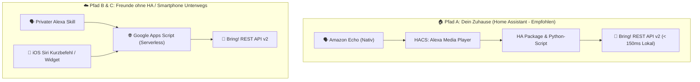

# 🛒 Alexa ➔ Bring! Sync Hub (Echtzeit & Universell)

[](LICENSE)
[](https://www.home-assistant.io/)
[](https://www.python.org/)
[](https://www.getbring.com/)
[](https://script.google.com/)

> **Die ultimative Lösung für die nahtlose Sprachsynchronisation zwischen Amazon Alexa, Apple Siri und der Bring! Einkaufsliste.**  
> Funktioniert trotz der Abschaltung der offiziellen Amazon List-Skills (Juli 2024) – 100 % zuverlässig, mit automatischer Mengentrennung und bunten Katalog-Icons!

---

## 🌟 Highlights

* 🗣️ **Nativer Sprachbefehl:** *„Alexa, setze 2 Bananen und 500g Quark auf die Einkaufsliste“*
* 🧠 **Intelligente Mengentrennung:** Name = `Quark`, Mengenspezifikation = `500g`
* 🍑 **Universeller deutscher Sprachstamm-Algorithmus (Lemmatizer):** Erkennt automatisch alle Pluralformen (*Erdbeeren ➔ Erdbeere*, *Tomaten ➔ Tomate*, *Haferflocken ➔ Haferflocken*) und wählt immer das **offizielle, bunte Bring!-Katalog-Icon**!
* ⏱️ **Zero-Delay (< 150 ms):** Läuft in Home Assistant zu 100 % lokal ohne externe Webhooks oder Kaltstarts.
* 🛡️ **Timestamp-Deduplizierung:** Verhindert das versehentliche Wiederholen alter Befehle bei Neustarts oder Reconnects.
* 👥 **Multi-User fähig:** Beliebige Bring!-Listen konfigurierbar (`bring_list_name`).

---

## 🏗️ Die 3 Lösungs-Pfade im Überblick



---

## 🚀 Pfad A: Home Assistant (100 % Lokal – 3 Minuten Setup)

### 📋 Voraussetzungen
1. Home Assistant mit installiertem **HACS**
2. Die kostenlose Integration **`Alexa Media Player`** (via HACS) mit deinem Amazon-Konto verbunden.

### 📥 Installation

1. **Dateien kopieren:**
   * Kopiere [`homeassistant/packages/alexa_bring_sync.yaml`](homeassistant/packages/alexa_bring_sync.yaml) in deinen Ordner `/config/packages/`.
   * Kopiere [`homeassistant/scripts/bring_sync.py`](homeassistant/scripts/bring_sync.py) in deinen Ordner `/config/scripts/`.

2. **Packages in `configuration.yaml` aktivieren:** (falls noch nicht vorhanden)
   ```yaml
   homeassistant:
     packages: !include_dir_named packages
   ```

3. **Zugangsdaten in `/config/secrets.yaml` hinterlegen:**
   ```yaml
   bring_email: "deine-email@example.com"
   bring_password: "dein-bring-passwort"
   bring_list_name: "Einkaufsliste" # Optional (Standard: "Einkaufsliste")
   ```

4. **Echo-Entity prüfen:**
   In [`homeassistant/packages/alexa_bring_sync.yaml`](homeassistant/packages/alexa_bring_sync.yaml) ist standardmäßig `media_player.echo_dot` als Auslöser hinterlegt. Passe den Namen an, falls dein Echo anders heißt (z. B. `media_player.wohnzimmer_echo`).

5. **Home Assistant neu starten.** Fertig! 🎉

---

## ☁️ Pfad B: Privater Alexa Skill (Für Freunde & Familie ohne Home Assistant)

Läuft 24/7 kostenlos in Google Apps Script (Serverless).

1. **Google Apps Script Backend bereitstellen:**
   * Erstelle ein Projekt auf [script.google.com](https://script.google.com).
   * Lade alle Dateien aus dem Ordner [`google-apps-script/`](google-apps-script/) hoch (`clasp push`).
   * Hinterlege in den **Projekteinstellungen (⚙️) ➔ Skripteigenschaften**:
     * `BRING_EMAIL` = `deine-email@example.com` *(Pflicht)*
     * `BRING_PASSWORD` = `dein-passwort` *(Pflicht)*
     * `BRING_LIST_NAME` = `Einkaufsliste` *(Optional, Standard: Standard-Liste)*
     * `API_SECRET_KEY` = `mein-geheimer-schluessel` *(Optional für Webhook-Absicherung)*
   * Klicke auf **Bereitstellen ➔ Neue Bereitstellung** (Web-App, Zugriff: *Jeder*) und kopiere die Web-App-URL.

2. **Alexa Custom Skill anlegen:**
   * Öffne die [Amazon Developer Console](https://developer.amazon.com/alexa/console/ask).
   * Erstelle einen neuen Custom Skill (*Name:* `Bring Liste`, *Sprache:* `German (DE)`).
   * Importiere das Sprachmodell aus [`alexa-skill/alexa-interaction-model-de.json`](alexa-skill/alexa-interaction-model-de.json) im **JSON Editor**.
   * Trage unter **Endpoint** deine Google Apps Script Web-App-URL ein (HTTPS).
   * **Aufruf:** *„Alexa, sag Bring: 2 Kilo Äpfel und Haferflocken“*!

---

## 📱 Pfad C: iOS Siri Kurzbefehl & Android Widget

Für die schnelle Spracheingabe unterwegs im Auto oder beim Spazierengehen:

1. Erstelle einen **iOS Kurzbefehl** namens *„Einkaufsliste“*.
2. Füge die Aktion **„Diktierter Text“** hinzu.
3. Sende einen **HTTP POST** an deine Google Apps Script Web-App URL mit folgendem JSON-Payload:
   ```json
   {
     "text": "Diktierter Text",
     "key": "mein-geheimer-schluessel"
   }
   ```
   *(💡 **Hinweis zu `key`:** Falls du in den Google Apps Script Skripteigenschaften `API_SECRET_KEY` gesetzt hast, trage denselben Wert hier als `key` ein).*
4. **Aufruf:** *„Hey Siri, Einkaufsliste: 2 Gurken und 500g Quark“*!

---

## 📁 Repository-Struktur

```text
alexa-bring-sync/
├── homeassistant/                 # Pfad A: Home Assistant
│   ├── packages/
│   │   └── alexa_bring_sync.yaml  # Modulares Package (Automation & Shell-Command)
│   ├── scripts/
│   │   └── bring_sync.py          # Python Engine (Universal Lemmatizer & API)
│   └── secrets.yaml.example       # Konfigurationsvorlage
├── google-apps-script/            # Pfad B & C: Serverless Backend
│   ├── AlexaSkillHandler.js       # Alexa Skill Request Handler
│   ├── BringApi.js                # Bring! REST API v2 Client
│   ├── Code.js                    # Webhook Controller & doPost
│   ├── Config.js                  # Konfigurationsmanager
│   └── ItemParser.js              # NLU-Sprachparser & Lemmatizer
├── alexa-skill/
│   └── alexa-interaction-model-de.json # Alexa Sprachmodell
├── LICENSE                        # MIT License
└── README.md                      # Dokumentation
```

---

## 📄 Lizenz

Dieses Projekt ist unter der [MIT-Lizenz](LICENSE) lizenziert.
